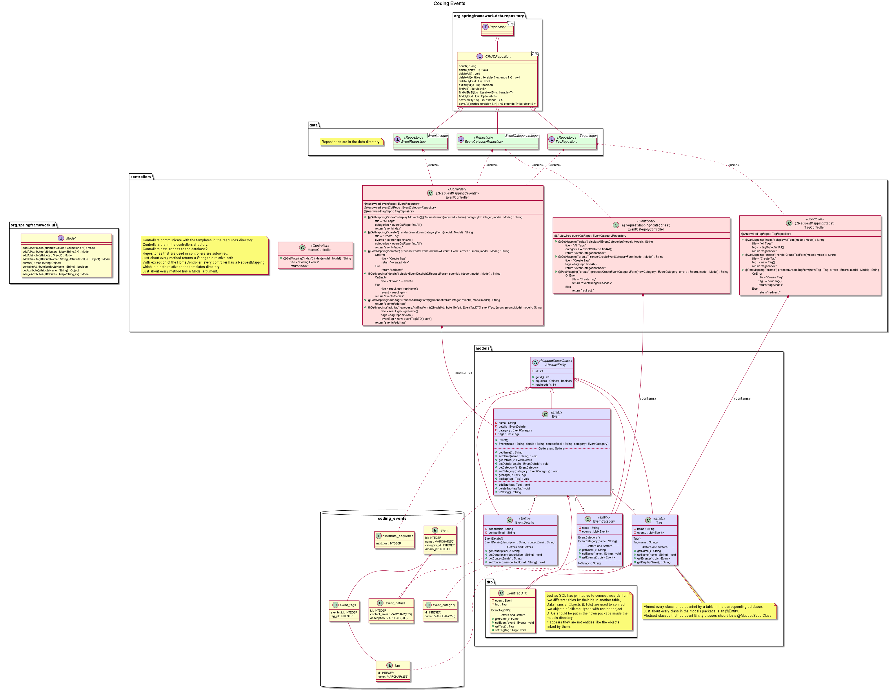

# Coding Events

> Note: This really isn't a list of coding events. It is more of an exercise using Thymeleaf.
> It could have practical applications though.

Turns out I didn't commit after each subchapter so I can't do the exercise here. So there is no `my-exercise-solution` branch.

Starting in Chapter 12, a new branch `create-model` is used for this project with Models.

Also tried to fix a couple of things that weren't done in chapter 13 and 14.

If you are reading this, welcome to many-to-one!

In chapter 18, as much as it irks me to downgrade software, changes need to be made to `build.gradle` and `gradle/gradle-wrapper.properties`.

In `build.gradle`, `org.springframework.boot` needs to be downgraded to version 2.2.7.

```
plugins {
   id 'org.springframework.boot' version '2.2.7.RELEASE'
   id 'io.spring.dependency-management' version '1.0.9.RELEASE'
   id 'java'
}

...
```

In `gradle/gradle-wrapper.properties`, the `distributionURL` needs to be set to 6.3-all.

```
distributionBase=GRADLE_USER_HOME
distributionPath=wrapper/dists
distributionUrl=https\://services.gradle.org/distributions/gradle-6.3-all.zip
zipStoreBase=GRADLE_USER_HOME
zipStorePath=wrapper/dists
```

Those changes mean another 145MB of software to download. So be sure to run a `gradle clean build` to get rid of unused versions.

Anytime you need to change your SQL tables, it will be easier just to DROP them than TRUNCATE them. Do it in this order.

```sql
DROP TABLE IF EXISTS coding_events.hibernate_sequence;
DROP TABLE IF EXISTS coding_events.event;
DROP TABLE IF EXISTS coding_events.event_details;
DROP TABLE IF EXISTS coding_events.event_category;
DROP TABLE IF EXISTS coding_events.event_tags;
DROP TABLE IF EXISTS coding_events.tag;
```

That should fix things. I'm not happy with the downgrade, but thanks to Bobby Sanders for the fix.

> PSST: Check out the SQL files in the assets folder!

## Database ERD

Here's an **entity relationship diagram** (ERD) of our database.


Each shape represents an entity. Tables are circles. Fields are rectangles. Fields with bold text are fields used as indexes (primary or foreign keys)
Each line represents a relationship. Green lines are primary keys. Blue lines are foreign keys.

## Application Class Diagram

Using PlantUML can be such a drag sometimes. Thing don't show up in the order you want so paths don't align and you get things in weird places.

There should be other diagrams that show this diagram in parts based on each package.



> Note: Not all the annotations were included in that diagram.
> I also had to be a little unorthodox and wanted to show what variables the controller functions used as well as what paths were returned in the controllers.

More succinctly, this diagram show the Model-View-Controller (MVC) layout of the application, which honestly should be more <abbr title="Model-Controller-View">MCV</abbr> than <abbr title="Model-View-Controller">MVC</abbr>.


Event though Repositories are put into the `data` directory, it is frequently used with the Controllers.

Finally merged many-to-one with the main branch. Welcome!

## TODO
Some Ideas. The ones closer to the bottom more than likely wouldn't fit into this course, but are worth thinking about.

* [ ] Rename `eventCategory` to simply `categories`
* [x] Make a class diagram of the OOP parts of this project.
* [x] Make an entity-relationship diagram (ERD) for the database parts of this project.
* [ ] How would use case diagrams be relevant? (Testing?)
* [ ] Could this course have benefited from a Gantt chart to better imply the development/producton schedule?
* [ ] What kind of diagram could we use to describe the relationships between the database and the application? 
* [ ] If Agile Development is so great, why does it feel like I can't describe in a Software Development Life Cycle (SDLC)?